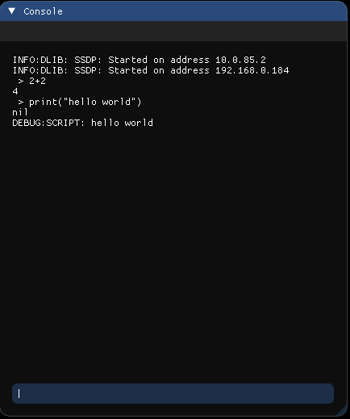

# DefConsole

DefConsole is an in-game debugging console for Defold Engine made with ImGUI.



## Setup

### Dependency

To integrate the **DefConsole** extension into your project, add this project as a [dependency](https://www.defold.com/manuals/libraries/) in your **Defold** game. Open your `game.project` file and add the following line to the dependencies field under the project section:

> [https://github.com/dima13230/DefConsole/archive/refs/tags/v0.1.zip](https://github.com/dima13230/DefConsole/archive/refs/tags/v0.1.zip)

**DefConsole** depends on ImGUI extension for Defold Engine and to use it you have to also add ImGUI extension into your project dependencies. Currently, **DefConsole** uses my own fork of this extension with a bit of functionality added to it (although I already made a pull request to the base repo), so to be able to use this extension add following line to the dependencies field as well:
> [https://github.com/dima13230/extension-imgui/archive/refs/heads/master.zip](https://github.com/dima13230/extension-imgui/archive/refs/heads/master.zip)

## Usage

To use the **DefConsole** add the
> defconsole/console.collection

To your scene. Then add the `console_toggle` in your input bindings with the button you want to be able to toggle console with.

You can add your own functions and variables to be available in the console. Here's an example of how to do that:
```lua
local console = require("defconsole.console_module")

-- Console commands extension
function message(object, id)
	msg.post("level_holder:/collection0/" .. object, id)
end
ext.message=message
```
Then you can type this in the console:
`ext.message("door", "open")`

## TODO

- [ ] Auto scrolling of console output
- [ ] Save story of commands and use up/down arrows to restore them into the input field

## Contributions & Sponsors

Any contributions or sponsorships are welcome. Although all contributors will be shown in special section by GitHub itself, I'll maintain here a list of top contributors as well as full list of sponsors (if sponsors desire so).

USDT TRC20:
> TESXiLVwPrgDqWvPSYfU4pXKc7gTaXcvVE

[ЮMoney](https://yoomoney.ru/to/4100116685386196)

---
